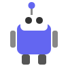
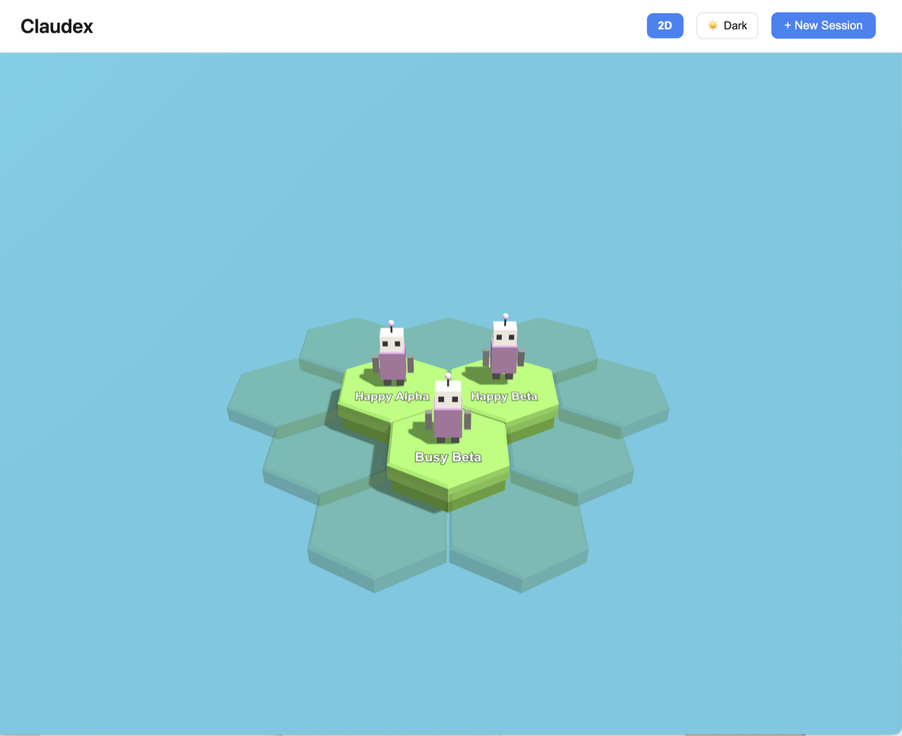
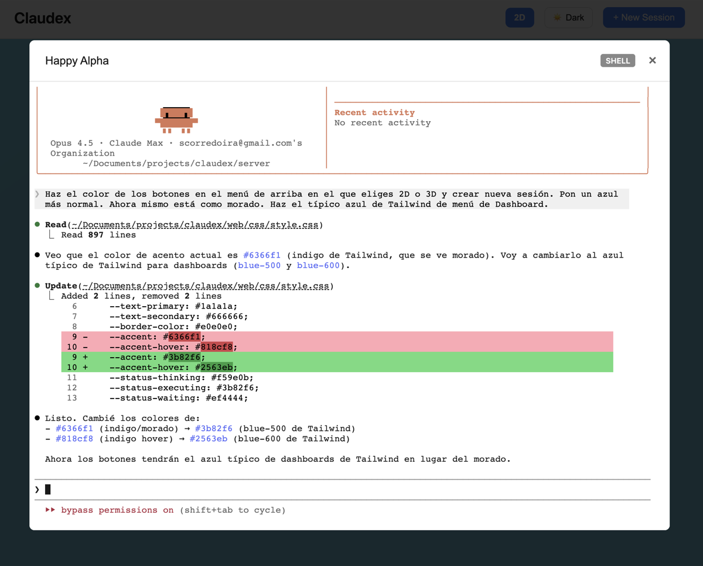
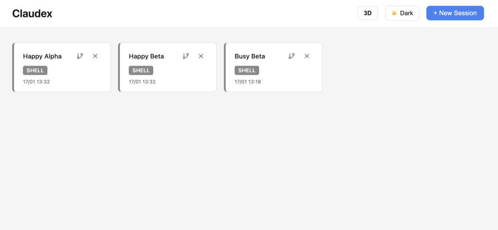

<p align="center">
  
</p>

<h1 align="center">Claudex</h1>

<p align="center">
  A multi-session manager for <a href="https://docs.anthropic.com/en/docs/claude-code">Claude Code</a> with an interactive 3D visualization.<br>
  Run and monitor multiple Claude Code instances from a single web interface.
</p>



## Features

- **3D World View**: Navigate your sessions in an interactive 3D environment with cute robots on hexagonal tiles
- **Multiple Sessions**: Run several Claude Code instances simultaneously
- **Real-time Status**: Visual indicators show what each session is doing (idle, thinking, executing, waiting for input)
- **Full Terminal**: Complete xterm.js terminal with UTF-8 support and all keyboard shortcuts
- **Session Experiments**: Fork any session to create experimental branches
- **Robot Customization**: Personalize each session's robot with different models, colors, and accessories
- **Light/Dark Theme**: Toggle between themes with persistent preference
- **Desktop Notifications**: Get notified when a session needs your attention



## Views

Switch between two views:

- **3D World**: Interactive hexagonal world where each session is represented by a customizable robot
- **Cards View**: Traditional grid layout showing session cards



## Quick Start

### Prerequisites

- Go 1.21+
- [Claude Code](https://docs.anthropic.com/en/docs/claude-code) installed and configured

### Run

```bash
cd server
go build -o claudex .
./claudex
```

Open http://localhost:8080

## Architecture

```
claudex/
├── server/              # Go backend
│   ├── main.go          # HTTP server entry point
│   ├── session/
│   │   ├── session.go   # PTY session with Claude Code
│   │   └── manager.go   # Multi-session management
│   └── ws/
│       └── handler.go   # WebSocket for real-time communication
├── web/                 # Frontend
│   ├── index.html
│   ├── css/style.css
│   └── js/
│       ├── app.js       # Main application logic
│       └── world3d.js   # Three.js 3D world
└── sessions/            # Session persistence (JSON)
```

## Technology Stack

- **Backend**: Go with [gorilla/websocket](https://github.com/gorilla/websocket) and [creack/pty](https://github.com/creack/pty)
- **Frontend**: Vanilla JavaScript with [xterm.js](https://xtermjs.org/) and [Three.js](https://threejs.org/)
- **Communication**: WebSocket with Base64 encoding for proper UTF-8 handling

## Keyboard Shortcuts (3D View)

- **Space**: Center camera on sessions
- **Cmd/Ctrl**: Show session labels on tiles
- **Click on robot**: Open radial action menu
- **Click on empty tile**: Create new session

## API

### WebSocket Messages

Client → Server:
- `subscribe` / `unsubscribe`: Session output subscription
- `start` / `stop`: Control Claude Code process
- `input`: Send terminal input
- `resize`: Update terminal dimensions

Server → Client:
- `output`: Terminal data (Base64)
- `status`: Session state changes

### REST Endpoints

- `GET /api/sessions` - List all sessions
- `POST /api/sessions/create` - Create new session
- `DELETE /api/sessions/{id}` - Delete session
- `PUT /api/sessions/{id}/name` - Rename session
- `PUT /api/sessions/{id}/customize` - Update robot customization
- `POST /api/sessions/{id}/experiment` - Create experiment fork

## License

MIT
